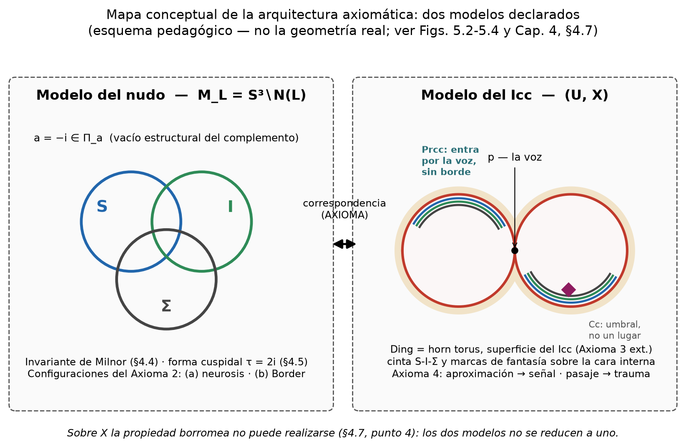
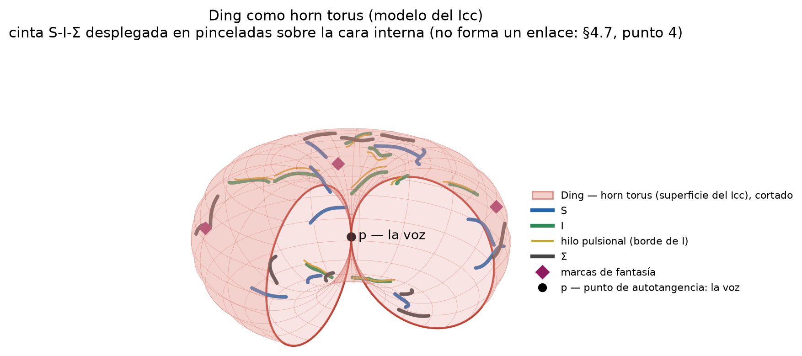
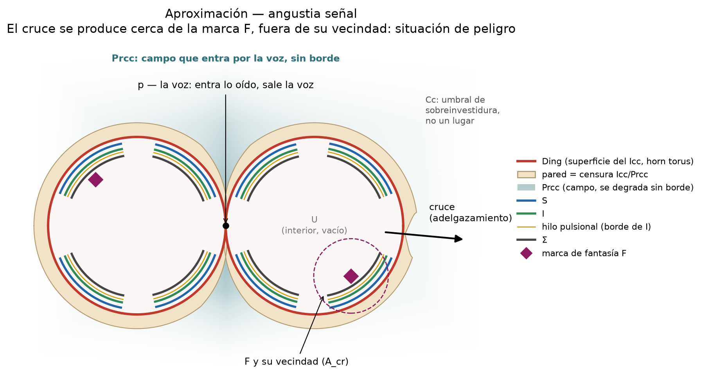
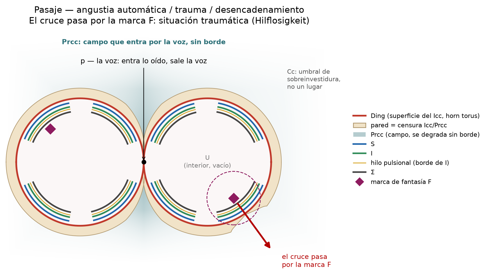
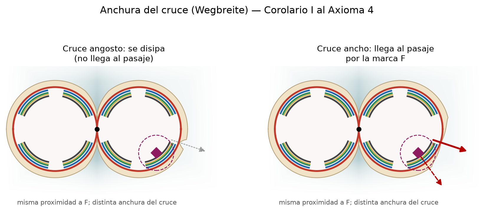
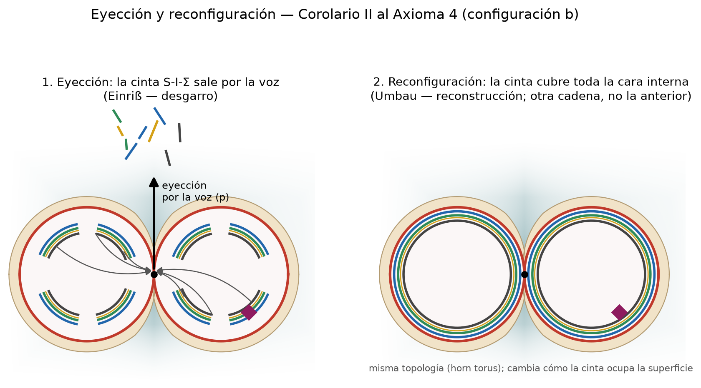

# El modelo del horn torus del Icc

Descripción pública del modelo que implementa la app. Sigue la disciplina del trabajo del que proviene: cada afirmación se marca según su estatuto.

- **CITA** — verificada contra el texto original, con ubicación.
- **LECTURA** — resonancia razonable, todavía sin confirmar como equivalencia.
- **AXIOMA** — construcción propia del modelo, sin anclaje textual.

La geometría es exacta; su lectura psicoanalítica es, salvo indicación, **AXIOMA**. Nada de lo que muestra la app es un diagnóstico.

## 1. Dos modelos

- **Modelo del nudo** — el complemento del enlace S ∪ I ∪ Σ en S³. Allí se calculan los invariantes del nudo (invariante de Milnor, forma cuspidal) y se definen las configuraciones del enlace.
- **Modelo del Icc** — el horn torus con su interior. Es lo que dibuja la app.

Los dos modelos no se reducen a uno: tres curvas cerradas disjuntas sobre el horn torus solo pueden ser círculos coaxiales alrededor del eje, que no están enlazados. Sobre la superficie la propiedad borromea no puede realizarse. La correspondencia entre ambos modelos es **AXIOMA**.

## 2. La superficie

El horn torus es el toro de revolución con R = r: el círculo interno colapsa a un punto **p** (el punto de autotangencia). Topológicamente es una esfera con dos puntos identificados. **No es una variedad**; su característica de Euler es χ = 1 y el género no está definido. Divide el espacio en dos regiones (dualidad de Alexander): el interior, un toro sólido abierto, y el exterior.

- **Toda la superficie es el Icc** — AXIOMA.
- **La pared es la censura Icc/Prcc**: un límite nítido, con adelgazamientos variables que son vías de salida (palabra deformada, Agieren, sublimación) — AXIOMA.
- **Cinta S-I-Σ** desplegada en pinceladas sobre la cara interna; el hilo pulsional (Trieb, Drang constante) corre pegado al borde de I, la imagen del cuerpo — AXIOMA.

## 3. La voz y el Prcc

**p es el único orificio fijo, de doble sentido: por él entra lo oído y sale la voz.**

- CITA — Lacan, *Seminario XI*, clase del 20 de mayo de 1964: las orejas son el único orificio del campo del inconsciente que no puede cerrarse; en la discusión de esa clase, Lacan nombra, de modo tentativo, la «pulsión invocante».
- CITA — Freud, *Das Ich und das Es* (1923), GW XIII, cap. II: los restos de palabra provienen esencialmente de percepciones acústicas, lo que da al sistema Prcc un origen sensorial particular; la palabra es el resto mnémico de la palabra oída.
- CITA — ibíd., cap. V: el superyó no puede desmentir su procedencia de lo oído, pero la energía de investidura de sus contenidos viene del ello, no de la percepción auditiva.

**El Prcc no es un espesor de la pared: es el campo de representaciones-palabra que entra por p**, concentrado en el embudo que el exterior del horn torus forma a lo largo del eje y comunicado con toda la superficie, **sin un borde donde termine** — AXIOMA.

**La Cc no es un lugar, sino un umbral** de sobreinvestidura dentro de ese campo:

- CITA — Freud, *Das Unbewusste* (1915), GW X, sección VI: la diferencia más significativa no hay que buscarla entre consciente y preconsciente, sino entre preconsciente e inconsciente; los retoños del Icc crecen en el Prcc hasta cierta intensidad de investidura y, al sobrepasarla, se topan con una segunda censura entre Prcc y Cc; el hacerse consciente es probablemente una sobreinvestidura.

La asimetría —límite nítido entre Icc y Prcc, paso sin borde entre Prcc y Cc— tiene apoyo textual; su forma geométrica (embudo, campo sin borde) es AXIOMA. En la app, el campo se dibuja como una nube de puntos fuera del volumen, más densa cerca de p.

## 4. Marcas de fantasía y angustia

La fantasía (concepto freudiano) son **marcas Icc de trauma** sobre la cara interna, distintas entre sí y de contenido desconocido: se ven sus efectos, no lo que son. La app admite una o varias — AXIOMA.

La angustia surge por **proximidad** a una marca, en dos regímenes:

| | |
|---|---|
|  |  |
| **Aproximación:** un cruce se produce cerca de la marca, fuera de su vecindad — situación de peligro, angustia señal. | **Pasaje:** el cruce pasa por la marca — situación traumática (desvalimiento). |

- CITA — Freud, *Hemmung, Symptom und Angst* (1926), GW XIV, p. 199: la situación traumática es de desvalimiento (Hilflosigkeit); en la situación de peligro, que la anticipa, se da la señal de angustia.
- CITA — Lacan, *Seminario X*: la angustia es «lo que no engaña» (8 de mayo de 1963) y «no es sin objeto» (29 de mayo de 1963).
- LECTURA — que el pasaje produzca angustia automática porque la marca está «no ligada» (Freud, *Jenseits des Lustprinzips*) equivale «no simbolizado» a «no ligado»; Freud habla de ligadura, no de simbolización.

En la app, A(u, v) mide la proximidad (distancia periódica) a la marca más cercana; la vecindad crítica es la unión de discos de radio A_cr = π/4 alrededor de las marcas, y el resumen informa el porcentaje de **área**.

## 5. Anchura del cruce (Wegbreite)

A igual proximidad, un cruce angosto se disipa y uno de anchura suficiente llega al pasaje.

- CITA — Freud, *Entwurf einer Psychologie* (1895): la anchura de vía (Wegbreite) es un factor distinto de la cantidad y de la resistencia.
- AXIOMA — su traslado al ancho del adelgazamiento de la pared. En la app es el parámetro δ; el techo es π/6.

## 6. Ruptura del modelo

Con IGS ≥ 3× el corte T=60 de la población y anchura suficiente, la cinta sale eyectada por la voz y luego se reconfigura cubriendo la cara interna. La topología no cambia; cambia cómo la cinta ocupa la superficie.

- CITA — Freud, «Neurose und Psychose» y «Der Realitätsverlust bei Neurose und Psychose» (1924): desgarro (Einriß) de la relación del yo con la realidad y fase de reconstrucción (Umbau).
- AXIOMA — su identificación con la eyección por la voz y la reconfiguración de la cinta.

**Esta secuencia no infiere estructura clínica.** Un Psicoticismo alto no es forclusión, y un IGS extremo no es un diagnóstico.

## 7. Pregunta abierta: Σ como pantalla

No está decidido si Σ opera como **pantalla** que aleja los cruces de las marcas o como **mero anudamiento** que no incide en dónde se producen. La app lo hace conmutable ("Σ como pantalla") y compara el área de la zona de angustia en los dos regímenes.

## 8. SCL-90-R

- Baremos de Casullo – Pérez (UBA): adultos y adolescentes, por sexo. T < 60 normal; T ≥ 60 sintomático; T ≥ 63 en riesgo.
- Carga por puntajes directos (con validación de consistencia) o por puntajes T (convertidos a PD con el baremo; fuera de la tabla, extrapolación marcada).
- **Todas las asignaciones entre escalas y geometría son AXIOMA** (por ejemplo, S ← Ansiedad y Obsesión; I ← Somatización y Sensibilidad Interpersonal; Σ ← Psicoticismo y Hostilidad). No son resultados validados; el instrumento que las fundaría requiere definiciones operacionales, validez convergente y discriminante, y una función de mapeo no circular.

## Pendiente de verificación

- Paginación exacta de las citas de GW XIII (caps. II y V) y GW X (secc. VI), y cotejo con Amorrortu.
- Cotejo del *Seminario XI* con la edición Paidós.
- Revisión, por un topólogo, de dos cálculos propios: que el exterior del horn torus es simplemente conexo, y que tres curvas disjuntas sobre él no pueden formar un nudo borromeo.
